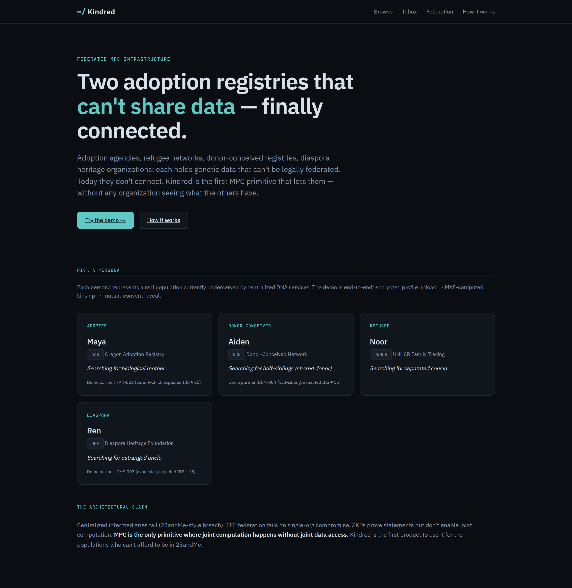
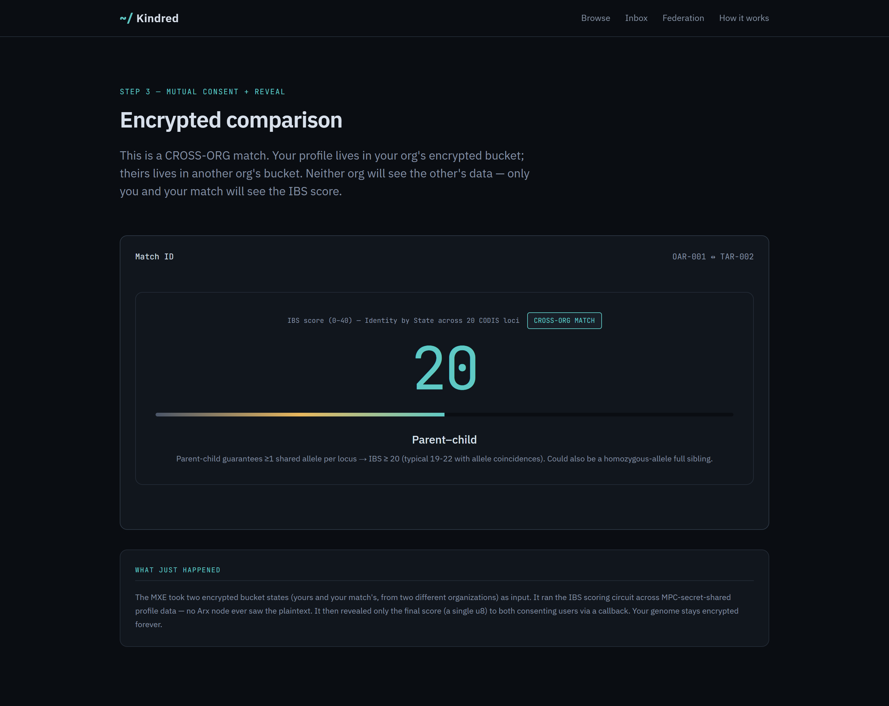
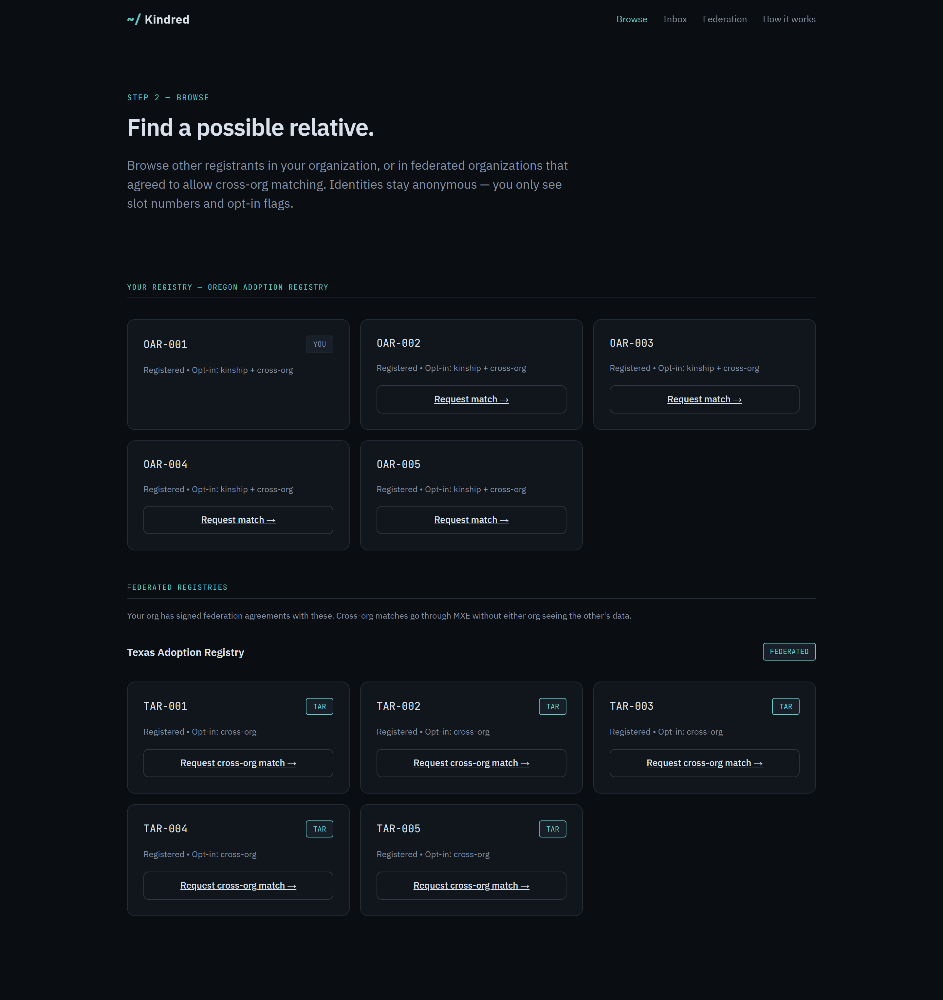
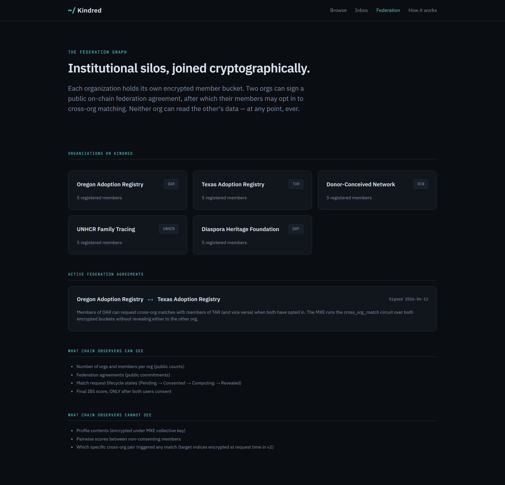

# Kindred

**Federated MPC infrastructure for genomic matching.**

> Two adoption registries that legally cannot share data — finally connected, without either seeing what the other has.

[](LICENSE)
[](https://solana.com)
[](https://arcium.com)
[](https://rtg.arcium.com/rtg/dev-dna-matching)

**[Live demo](https://kindred.gudman.xyz)** · **[90-second walkthrough](https://youtu.be/rBao3EV8PtI)** · **[Architecture](docs/ARCHITECTURE.md)** · **[Threat model](docs/THREAT_MODEL.md)** · **[Writeup](docs/BLOG_POST.md)**



Kindred is the first MPC primitive for cross-organizational genomic matching, built on [Arcium](https://arcium.com) and Solana. Adoption agencies, refugee-tracing networks, donor-conceived registries, diaspora heritage organizations: each holds genetic data that cannot be legally federated. Today they don't connect. Kindred is the layer that lets them — without any organization seeing what the others have.

Submission to the [Arcium Road to Genesis — DNA Matching track](https://rtg.arcium.com/rtg/dev-dna-matching).

---

## Why MPC, specifically

| Architecture | Failure mode |
|---|---|
| Centralized intermediary | Same architectural failure as the 23andMe 2023 breach |
| TEE federation | Single org's enclave compromise leaks all federated orgs |
| ZKP | Proves statements but no joint-input compute primitive |
| **MPC (Arcium)** | **Joint computation without joint data access — the only primitive that works** |

This is the load-bearing technical claim of the project.

---

## How it works

**Per-organization encrypted bucket.** Each `Org` owns an `Enc<Mxe, ProfileBucket>` on Solana. Members register into their org's bucket via the `register_profile` MXE circuit. Bucket state is never decrypted outside MPC-secret-shared form.

**Federation agreement.** Two org admins sign a public `FederationAgreement` PDA. Once signed, their members may opt in to cross-org matching.

**Cross-org match.** The `cross_org_match` MXE circuit takes **both orgs' encrypted buckets** as inputs and computes IBS scoring across secret-shared profile data. The score (a single `u8`) is revealed only after both users sign consent.

**Honest scope.** 20 STR loci reliably distinguish parent-child and full siblings from unrelated. Beyond 2nd-degree relatives, variance dominates and we do not claim those matches.

### Cross-org match, end to end

A profile in the Oregon Adoption Registry and a profile in the Texas Adoption Registry are scored inside the MXE. Neither registry ever decrypts the other's bucket — the IBS score is revealed only to the two consenting users.



### Browse your registry and federated ones

Registrants are anonymous — only slot numbers and opt-in flags are public. The view splits between your own organization and any organization it has signed a federation agreement with.



### The federation graph

Organizations are sovereign and blind to each other. The graph shows which orgs exist, which have signed federation agreements, and exactly what an on-chain observer can and cannot see.



---

## Demo orgs and personas

| Persona | Org | Match | Mode |
|---|---|---|---|
| Maya — adoptee | Oregon Adoption Registry | Profile #102 in Texas Adoption Registry | **CROSS-ORG** ⭐ |
| Aiden — donor-conceived | Donor-Conceived Network | Profile #204 in same org | intra-org |
| Noor — refugee | UNHCR Family Tracing | (no match in registry) | intra-org |
| Ren — diaspora | Diaspora Heritage Foundation | Profile #408 in same org | intra-org |

Maya's flow demonstrates the federation primitive end-to-end: two separate adoption registries that legally cannot share data, joined cryptographically. The demo org names are illustrative, not partnerships.

---

## Architecture

```
┌──────────────────┐      enc       ┌──────────────────┐     queue     ┌──────────────────┐
│  Browser (React) │ ─────────────► │  Anchor program  │ ────────────► │   Arcium MXE     │
│                  │                │  (Solana devnet) │               │                  │
│  x25519 + Rescue │                │  Org / Bucket    │               │  register_profile│
│  CODIS parser    │                │  Federation PDA  │               │  cross_org_match │
│  score viewer    │ ◄───────────── │  MatchRequest SM │ ◄──────────── │  (Arcis circuit) │
└──────────────────┘    callback    │  verify_output() │   callback    └──────────────────┘
```

Full sequence diagrams in [docs/ARCHITECTURE.md](docs/ARCHITECTURE.md). The IBS scoring circuit and its correctness proof are in [docs/CIRCUIT_DESIGN.md](docs/CIRCUIT_DESIGN.md).

---

## What's in this repo

```
kindred/
├── Anchor.toml, Arcium.toml, Cargo.toml, package.json
├── programs/kindred/src/lib.rs       # Anchor program: 5 accounts, 12 instructions, 4 callbacks
├── encrypted-ixs/src/lib.rs          # Arcis circuits: init_org_registry, register_profile, intra_org_match, cross_org_match
├── app/                              # Vite + React + TS frontend
│   └── src/{pages,components,lib}/
├── tests/kindred.ts                  # End-to-end ts-mocha tests
├── data/synthetic-profiles/          # Mendelian-seeded CODIS profiles for demo
│   └── generate.ts                   # Reproducible profile generator
├── docs/
│   ├── ARCHITECTURE.md
│   ├── CIRCUIT_DESIGN.md             # IBS proof + hand-traced cases
│   ├── THREAT_MODEL.md               # What's protected, what isn't
│   ├── BLOG_POST.md                  # Manifesto / writeup
│   └── X_THREAD.md                   # Launch thread
├── AI_USAGE.md                       # Disclosure
└── README.md                         # This file
```

---

## Quickstart

### Prerequisites

- WSL2 Ubuntu (Arcium does not support native Windows)
- arcup 0.9.7 → arcium 0.9.7
- Solana CLI 2.3.0
- Anchor 0.32.1
- Rust 1.95.0+ (project pins 1.89.0 via rust-toolchain.toml)
- Node 22+ + Yarn
- Docker (for Arx node localnet)

```bash
curl -fsSL https://install.arcium.com/ | bash
arcup install
```

### Build and test

```bash
arcium build              # compiles Anchor program + Arcis circuits
arcium test               # localnet 2-node Cerberus cluster + ts-mocha
arcium test --cluster devnet
arcium deploy --cluster-offset <N>
```

### Frontend

```bash
cd app
npm install
npm run dev               # localhost:5173
```

### Synthetic data

```bash
cd data/synthetic-profiles
npx ts-node generate.ts   # writes profiles.json + csv/<id>.csv
```

---

## License

MIT — see [LICENSE](LICENSE).

## Acknowledgments

Built on Arcium MXE on Solana. The MPC infrastructure layer that makes cross-organizational compute possible.

Prior art: academic literature on secure multiparty kinship computation framed the cryptographic primitives operationalized here. Their work was research; Kindred ships it as institutional infrastructure.
